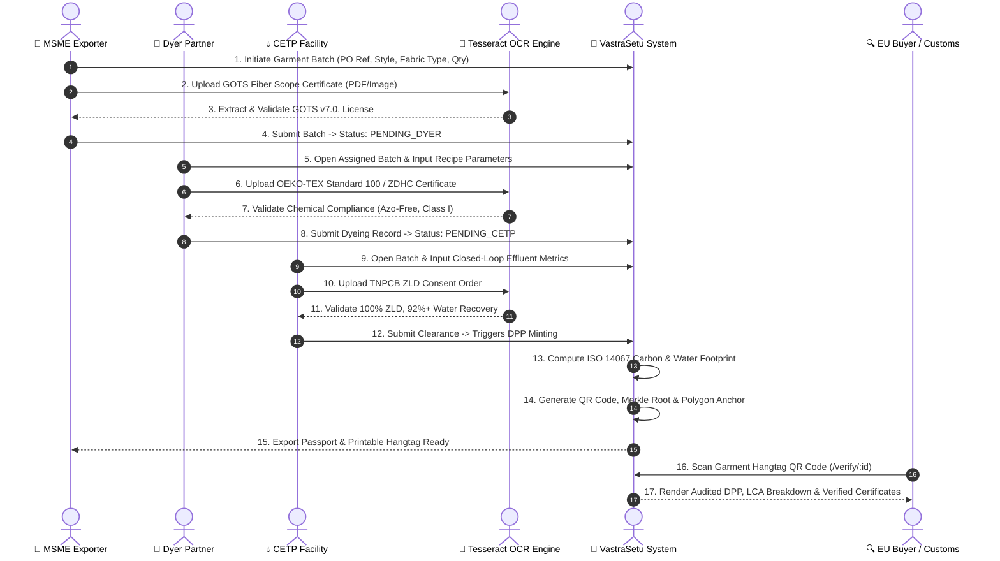
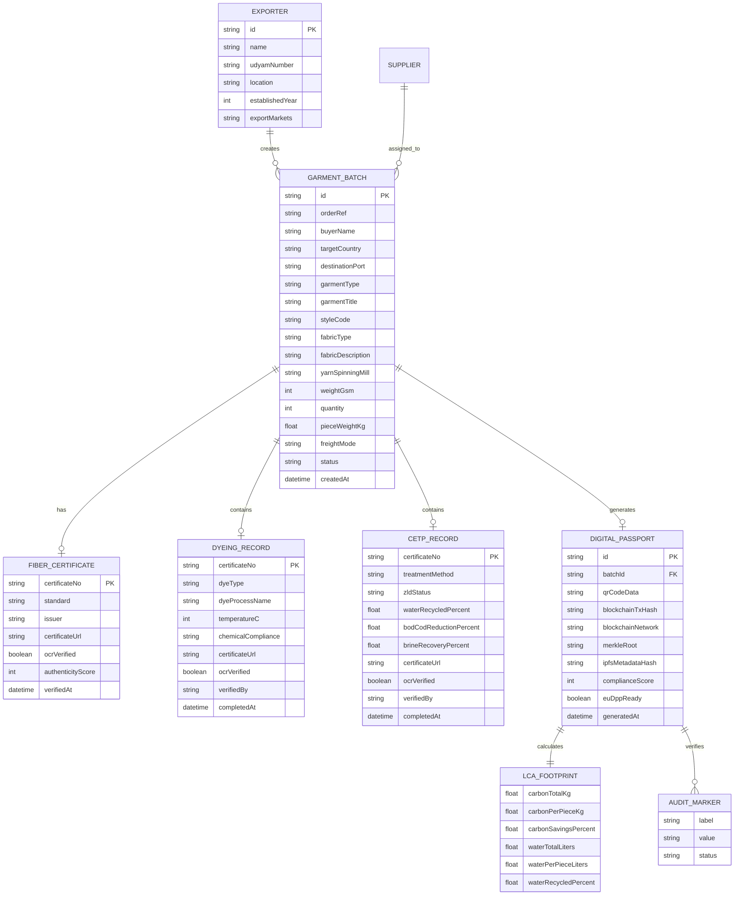

# 🌿 VastraSetu — Digital Product Passport (DPP) for Textile MSME Exporters

[](https://reactjs.org/)
[](https://vitejs.dev/)
[](https://tailwindcss.com/)
[](https://expressjs.com/)
[](https://github.com/tesseract-ocr/tesseract)
[](https://commission.europa.eu/energy-climate-change-environment/standards-tools-and-labels/products-labelling-rules-and-requirements/sustainable-products/ecodesign-sustainable-products-regulation_en)

> **Empowering Indian Textile MSME Exporters with EU Ecodesign (ESPR 2026) & Digital Product Passport Compliance through Automated Tesseract OCR & Transparent LCA.**

---

## 📌 Executive Summary & Problem Statement

Under the **European Union’s Ecodesign for Sustainable Products Regulation (ESPR 2026)**, every textile garment exported to the EU must carry a machine-readable **Digital Product Passport (DPP)**. Over 80% of India's textile exports originate from MSME clusters (such as Tiruppur, Coimbatore, and Surat), where compliance proof is fragmented across manual paper test certificates, decentralized dye houses, and Common Effluent Treatment Plants (CETPs).

**VastraSetu** bridges this gap:
1. **Multi-Stakeholder Collaboration**: Connects MSME Exporters, Dyeing Units, CETPs, and EU Buyers in a unified verification workflow.
2. **Automated Tesseract OCR & PDF Parsing**: Automatically reads and verifies GOTS, OEKO-TEX Standard 100, and TNPCB ZLD certificates from uploaded PDFs and images.
3. **ISO 14067 LCA & Water Footprint Engine**: Real-time formula-driven estimation of Scope 1, 2, and 3 emissions and closed-loop water recovery.
4. **Interactive QR Digital Passports & Physical Hangtags**: Dynamic QR generation linking directly to buyer-facing trust pages and printable 2.5" x 4.5" garment hangtags.

---

## 🏛️ System Architecture

```
                               ┌──────────────────────────────────────────────┐
                               │             VastraSetu Platform              │
                               └──────────────────────┬───────────────────────┘
                                                      │
         ┌─────────────────────────┬──────────────────┴──────────────┬─────────────────────────┐
         ▼                         ▼                                 ▼                         ▼
  🏢 MSME Exporter          🧪 Dyer Partner                   💧 CETP Facility          🔍 EU Buyer / Customs
 ┌──────────────────────┐  ┌──────────────────────┐          ┌──────────────────────┐  ┌──────────────────────┐
 │ • Create Batch       │  │ • Input Dye Recipe   │          │ • Input ZLD %        │  │ • Scan QR Code       │
 │ • Upload GOTS Cert   │  │ • Upload OEKO-TEX    │          │ • Upload TNPCB Cert  │  │ • Verify Provenance  │
 │ • Assign Supply Chain│  │ • Thermal Parameters │          │ • Clear Effluent     │  │ • Inspect LCA Carbon │
 └──────────┬───────────┘  └──────────┬───────────┘          └──────────┬───────────┘  └──────────┬───────────┘
            │                         │                                 │                         │
            └─────────────────────────┼─────────────────────────────────┘                         │
                                      ▼                                                           ▼
                      ┌───────────────────────────────┐                          ┌────────────────────────────────┐
                      │    Tesseract OCR & Parser     │                          │   Public Verification Ledger   │
                      │  • Local Tesseract v5.5.3     │                          │  • Polygon PoS Anchor          │
                      │  • pdf-parse Digital Stream   │                          │  • IPFS Metadata Hash          │
                      │  • Heuristic Rule Verifier    │                          │  • Interactive Certificate View│
                      └───────────────────────────────┘                          └────────────────────────────────┘
```

---

## 🔄 End-to-End Workflow Diagram



---

## 🗄️ Entity Relationship (ER) Diagram



---

## 🔍 Tesseract OCR & Certificate Verification Engine

VastraSetu features an automated verification pipeline that parses both digital PDFs and scanned image certificates.

### Supported File Formats
- `.pdf` (Vector and text-stream PDFs via `pdf-parse`)
- `.png`, `.jpg`, `.jpeg`, `.webp`, `.tiff` (via local **Tesseract OCR v5.5.3**)

### Verification Standards & Heuristics

| Standard | Target Document | Verified Markers |
| :--- | :--- | :--- |
| **GOTS v7.0** | Yarn Scope Certificate | Standard identifier, GOTS version, License/CU # (`CU-XXXXXX`), Accredited certifier (*Control Union, OneCert, Ecocert*), Organic content % |
| **OEKO-TEX Standard 100** | Wet Processing Test Report | Standard 100 Class I/II, Annex 4/6 compliance, Certificate # (`OEKO-XXXX-TX`), ZDHC MRSL Level 3, Testing institute (*Hohenstein, TESTEX*) |
| **TNPCB ZLD Order** | CETP Environmental Clearance | Tamil Nadu Pollution Control Board authority, 100% Zero Liquid Discharge, Closed-loop water recovery % (92–94%), Consent order # |

---

## 📊 ISO 14067 Carbon & Water Footprint Model

The platform integrates a transparent LCA engine based on **Higg MSI** and **ISO 14067**:

$$\text{Total CO}_2\text{e (kg)} = (W_{\text{batch}} \times E_{\text{fiber}}) + (W_{\text{batch}} \times E_{\text{dye}}) + (T_{\text{batch}} \times D_{\text{freight}} \times E_{\text{freight}}) + (W_{\text{batch}} \times E_{\text{mfg}})$$

- **Fiber Emission Factors ($E_{\text{fiber}}$):** Organic Cotton (3.4 kg/kg), Organic Blend (3.8 kg/kg), Modal/Tencel (4.1 kg/kg), Conventional Cotton (8.4 kg/kg).
- **Dye Emission Factors ($E_{\text{dye}}$):** Low-Impact Reactive (2.2 kg/kg), Natural Plant (1.2 kg/kg), Conventional Synthetic (4.8 kg/kg).
- **Water Recycling:** Factory closed-loop calculation factoring 92%+ CETP recovery vs conventional benchmark (2,400 L/kg).

---

## 🎭 Persona Switcher (For Demo & Evaluation)

A floating **Persona Switcher** in the top navigation bar enables testing all stakeholder perspectives without re-logging in:

| Persona | Role in Ecosystem | Key Actions on VastraSetu |
| :--- | :--- | :--- |
| 🏢 **MSME Exporter** | *Sri Jayavarma Knits (Tiruppur)* | Create batches, upload GOTS certificates via OCR, track cumulative ESG impact |
| 🧪 **Dyer Partner** | *Rainbow Eco-Dyers* | Input dye recipes, upload OEKO-TEX certificates with OCR verification |
| 💧 **CETP Facility** | *Arulpuram CETP Unit 3* | Record 92%+ water recovery, upload TNPCB ZLD clearance, trigger passport generation |
| 🔍 **EU Fashion Buyer** | *Inditex / Global Customs* | Scan QR code, inspect supply chain authenticity, verify carbon LCA & circularity |

---

## 🛠️ Project Structure

```
MSME/
├── client/                              # React 18 + Vite + Tailwind CSS Frontend
│   ├── index.html                       # HTML entry point with Google Fonts
│   ├── src/
│   │   ├── components/
│   │   │   ├── Navbar.jsx               # Brand header + Persona switcher
│   │   │   ├── StatusBadge.jsx          # Status pills (Draft, Pending Dyer, ZLD Cleared)
│   │   │   ├── BatchPipelineStepper.jsx # 5-step visual pipeline progress stepper
│   │   │   ├── CertificateUploadZone.jsx# Drag-and-drop zone with live Tesseract OCR
│   │   │   ├── CertificateModal.jsx     # Audited certificate inspector with OCR report
│   │   │   ├── HangtagPrintModal.jsx    # Printable 2.5" x 4.5" garment hangtag
│   │   │   ├── ESGReportModal.jsx       # Official ESG PDF report generator
│   │   │   └── Toast.jsx                # Toast alerts
│   │   ├── context/
│   │   │   └── AppContext.jsx           # Global state, role simulation, API client
│   │   ├── pages/
│   │   │   ├── LandingPage.jsx          # Hero + interactive carbon sandbox
│   │   │   ├── DashboardPage.jsx        # MSME command center & pipeline
│   │   │   ├── BatchesPage.jsx          # Garment batch central management
│   │   │   ├── BatchDetailPage.jsx      # Multi-tab batch audit view
│   │   │   ├── CreateBatchPage.jsx      # Batch wizard + GOTS OCR upload
│   │   │   ├── DyerPortalPage.jsx       # Dyer portal + OEKO-TEX OCR upload
│   │   │   ├── CetpPortalPage.jsx       # CETP portal + TNPCB ZLD OCR upload
│   │   │   ├── PassportViewPage.jsx     # Luxury centerpiece DPP card
│   │   │   ├── PublicVerifyPage.jsx     # Buyer-facing public verification
│   │   │   └── AnalyticsPage.jsx        # Sustainability ESG impact dashboard
│   │   ├── App.jsx                      # App root router
│   │   ├── main.jsx                     # React root mount
│   │   └── index.css                    # Design tokens & glassmorphism utilities
├── server/                              # Node.js + Express REST API
│   ├── data/
│   │   └── store.js                     # In-memory store with Tiruppur ecosystem seeds
│   ├── routes/
│   │   ├── batches.js                   # Batch creation, dyeing, CETP, and QR routes
│   │   ├── certificates.js              # Multipart file upload, OCR, and sample certs
│   │   └── analytics.js                 # Cumulative ESG & exporter metrics
│   ├── utils/
│   │   ├── ocrService.js                # Tesseract.exe CLI runner & pdf-parse
│   │   ├── certificateVerifier.js       # Rule-based heuristic standards validator
│   │   └── carbonCalculator.js          # ISO 14067 LCA estimation engine
│   └── index.js                         # Express server on port 5000
├── package.json                         # Unified scripts & dependencies
├── vite.config.js                       # Vite config with /api proxy
├── tailwind.config.js                   # Custom color tokens (deep teal, purple, sage)
└── README.md                            # Comprehensive documentation
```

---

## 🚀 Quick Start Guide

### Prerequisites
- [Node.js](https://nodejs.org/) (v18 or higher)
- [Tesseract OCR](https://github.com/tesseract-ocr/tesseract) (optional for local image OCR; auto-detected if installed at `C:\Program Files\Tesseract-OCR\tesseract.exe`)

### 1. Installation
```bash
git clone https://github.com/kabithadevirp-debug/Vastra-Setu-MSME.git
cd Vastra-Setu-MSME
npm install
```

### 2. Run in Development Mode
```bash
npm run dev
```
- **Frontend Application:** [http://localhost:5173](http://localhost:5173)
- **Backend Express API:** [http://localhost:5000](http://localhost:5000)

### 3. Production Build
```bash
npm run build
```

---

## 🧪 Testing the OCR Flow

1. Navigate to **[http://localhost:5173/create-batch](http://localhost:5173/create-batch)**.
2. In **Step 1 (Product Details)**, scroll to **Fiber Origin & GOTS Scope Certificate**.
3. Upload any PDF/Image certificate or click **"Test with Sample Cert"**.
4. Observe the OCR scanner extract the GOTS license number, certifying body, and organic percentage in real time.
5. Repeat in **Dyer Portal** (`/portal/dyer`) for OEKO-TEX Standard 100 and **CETP Portal** (`/portal/cetp`) for TNPCB Zero Liquid Discharge clearance.

---

## 📄 License

This project is licensed under the MIT License — see the [LICENSE](LICENSE) file for details.
